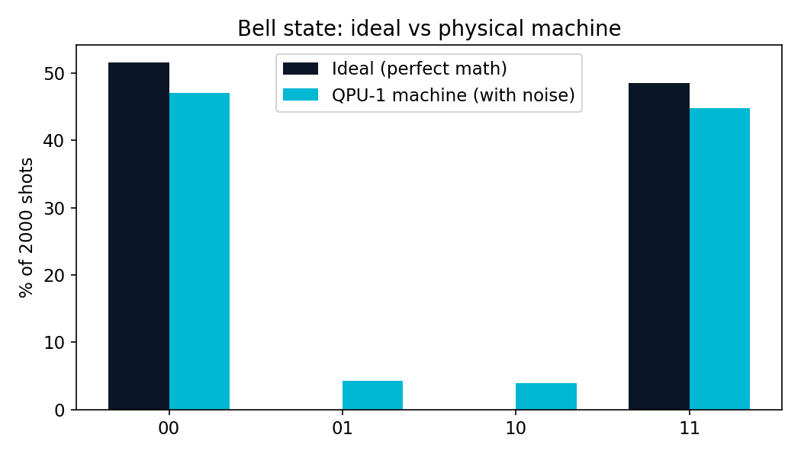
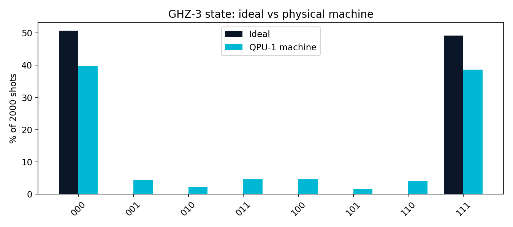
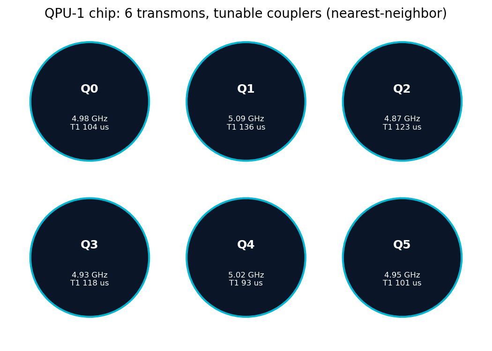

# Episode 1: I built a quantum computer in pure Python

*QPU-1 Lab Notes, part 1. Every chart in this series comes from a real run. No hand-waving.*

---

I built a quantum computer in Python. Not a metaphor, not a toy Bloch-sphere animation — a model of every physical part of a superconducting quantum machine: the transmon qubits, the chip, the dilution refrigerator, the microwave control rack, the readout chain, and the noise. Pure standard library. Zero dependencies. `pip install` and it runs.

Why? Because every pop-science explainer skips the hardware. They show you the circuit diagram and the histogram and nothing in between, as if "run circuit" were a single step. It isn't. Between the math and the measurement sits a machine colder than deep space, being shouted at with microwaves, and I wanted to know what actually happens in there.

So I built it. Here's the tour.

## The qubit

The workhorse is the transmon: a superconducting circuit that behaves like an artificial atom. Mine has a frequency, an anharmonicity (the thing that makes it a qubit instead of a harmonic oscillator), a T1 (how long it holds energy before relaxing) and a T2 (how long it holds phase). It also has a thermal population — at room temperature, it's scrambled garbage. Which brings us to the fridge.

## The fridge

A dilution refrigerator cools in stages: 50K, 4K, the still, 100 mK, and finally 10 millikelvin — colder than interstellar space. My model walks through every stage, because the cooldown isn't decoration: at 10 mK there are roughly 4×10⁻¹¹ thermal photons per qubit. Effectively zero. That's the whole point of the fridge.

My favorite detail: the warm machine refuses to run. Try to execute a circuit at 293 K and it won't — thermal population would scramble everything, so the interlock says no. Real labs have the same discipline. The physics doesn't care about your schedule.

## The chip

Six transmons on a grid with tunable couplers between neighbors, plus a router that finds paths across the connectivity. Six qubits is small, but it's honest — this is a NISQ-era machine, and the interesting physics shows up long before you need fifty qubits.

## The control rack

Here's the part the explainers never show you: a "gate" is not an abstract operation. It's a timed microwave pulse. My control electronics translate every gate in your circuit into a pulse schedule — frequencies, durations, phases. And some gates aren't pulses at all: Z, S, and T are *virtual*, executed in zero nanoseconds as a phase update in software. Free gates. The hardware people knew what they were doing.

## The readout chain

Measurement is a Rube Goldberg machine: the qubit shifts its readout resonator's frequency, the signal climbs through a TWPA (a near-quantum-limited amplifier sitting at 10 mK), then a HEMT amplifier at 4K, then digitization and IQ discrimination — deciding whether the blip in the I-Q plane was a 0 or a 1. My model includes the confusion: sometimes it guesses wrong, and those misclassifications are a real error term in every result you'll see in this series.

## The noise

Every shot runs a Monte-Carlo gauntlet: gate errors, T1 decay during the wait, readout misclassification. Not a full Lindblad master-equation simulation — I'll say that plainly in the limits section — but phenomenological noise tuned to behave like the real thing.

## First light

The "hello world" of quantum hardware is the Bell state: one Hadamard, one CNOT, measure both qubits. Ideal math says perfect 50/50 correlation. My machine, 2,000 shots:

```python
from qpu import QuantumComputer, QuantumCircuit

qc = QuantumComputer()      # 6-transmon chip, fridge, control rack, readout
qc.cooldown()               # 50K -> 4K -> still -> 100mK -> 10mK

bell = QuantumCircuit(2)
bell.h(0).cx(0, 1)
res = qc.run(bell, shots=2000)
print(res.counts)                # what the hardware measured
print(res.fidelity_vs_ideal())   # vs the perfect math
```

92.0% fidelity. The missing 8% isn't mysterious — you can see it in the counts as 01 and 10 error terms, mostly readout misclassification with a little gate error mixed in.

Then GHZ-3, the three-qubit entangled state: 80.8%. Deeper circuit, more gates, more exposure to noise — fidelity drops. That degradation curve is the signature of the entire NISQ era, and my little Python machine reproduces it without being told to.

Deutsch's algorithm — the first algorithm that beat classical — runs 4-for-4 on all oracles. Constant functions read 0, balanced functions read 1, exactly as the theory demands, with the noise riding along underneath.

## The wall

Benchmarks: 110,000 shots per second at 2 qubits. Ten seconds *per shot* at 20 qubits. The practical ceiling is around 20 qubits, and the reason is arithmetic, not code quality: n qubits means 2ⁿ amplitudes, and every added qubit doubles the memory and the work. Thirty qubits is a billion amplitudes. Forty is a trillion — beyond any machine on Earth.

Here's the thing, though: that wall is the entire point of real quantum computers. A 50-qubit chip *holds* 2⁵⁰ amplitudes in hardware — 16 petabytes no classical machine can store. My simulator hits the wall so you can feel exactly why the hardware matters.

## Honest limits

I'll do this at the end of every episode, because the genre has a hype problem:

- The noise is phenomenological Monte-Carlo, not a full Lindblad master equation. It behaves like the real thing; it isn't derived from first principles.
- No transpiler yet: circuit qubit *i* maps to chip qubit *i*. The router exists for future SWAP insertion.
- Classical state-vector core: ~20 qubits is the ceiling. This machine will never do anything a laptop can't — it's a laboratory for understanding, not a shortcut to quantum advantage.

## Next

A machine you can't measure is a paperweight. Next episode: I turn QPU-1 into an instrument and measure its T1 the way an experimentalist would — sweep the wait, fit the decay — and check whether the lab procedure recovers the physics I programmed in.







*All charts from real runs on QPU-1.*
