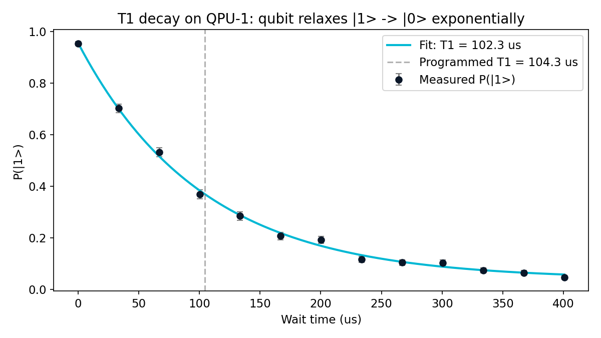

# Episode 2: Measuring T1 with microwaves and patience

*QPU-1 Lab Notes, part 2. Every number in this series comes from a real run.*

---

Last episode I built the machine. Now I turn it into an instrument.

A quantum computer you can't measure is a paperweight. Experimentalists don't get to read the device's spec sheet — they have to extract every parameter by interrogating the hardware. T1, the energy-relaxation time, is the first number anyone measures, because it sets the clock for everything else: your qubit forgets its energy on a timescale of T1, and no computation can outrun that.

Here's the procedure. It's almost insultingly simple, which is why it's beautiful.

Excite the qubit from |0> to |1> with a π-pulse. Wait a chosen delay. Measure. Repeat the shot many times at that delay and record the fraction that came back |1>. Then pick a longer delay and do it again. Sweep the wait from 0 to 400 µs and plot the survival probability.

Physics says the answer is an exponential: P(|1>) decays as e^(−t/T1). Fit the curve, read off T1.

One design choice worth noting: the sweep runs 0 to 400 µs, roughly four times the expected T1. That's deliberate. You want the early points to pin the starting level, the middle points to trace the curve's bend, and the late points — out where the signal has mostly decayed — to pin the floor. Cut the sweep short and the fit can't distinguish a slow decay from a high floor; the long tail is what breaks that degeneracy. Four T1s is the rule of thumb, and rules of thumb in experimental physics are just other people's hard-won mistakes.

I ran it on QPU-1:

Fitted T1: **102.3 µs**. The value I programmed into the qubit model: **104.3 µs**. Two percent off.

Stop and appreciate what just happened. The measurement is a noisy, finite-sampling procedure — every point on that curve is a pile of individual shots, each one a coin flip with its own error terms. The fit still landed within 2% of the ground truth. The lab procedure works. It recovers the physics.

It's worth saying why T1 is always the *first* number. Everything a quantum computer does has to happen inside the qubit's lifetime. Every gate you apply, every measurement you take, burns a slice of the coherence budget, and T1 is the hard ceiling on the energy side. A device with a 100 µs T1 and a device with a 50 µs T1 aren't just different by a factor of two — the second one gets half the circuit depth before its qubits start forgetting what they were doing. When experimentalists quote device specs, T1 is the headline because it's the clock everything else races.

And the measurement itself is never as clean as the textbook sketch. State preparation isn't perfect — your π-pulse leaves a little population behind. Measurement isn't perfect either — the readout chain misclassifies a fraction of shots, which is exactly the confusion model from episode 1's tour. All of that contamination sits inside the curve you're fitting. The reason the exponential fit is the standard procedure, rather than just reading off where the curve hits some value, is that the fit separates the decay constant from the offsets: preparation and readout errors shift the curve up or down, but the *rate* of decay is T1's signature alone. That's not a detail. That's the whole reason the procedure is trustworthy.

Look at the shape of the thing you're fitting, because the chart tells its own story. At zero wait, the survival probability starts near one — you just excited the qubit, of course it's still excited. As the wait stretches out, the points sag downward, faster at first in appearance, then flattening toward zero: the signature curve of exponential decay, each point a binomial estimate with its own error bar. The fit threads through them, and the residuals — the scatter of points around the line — are the size shot noise says they should be. Nothing systematic hiding in the leftovers. When a fit looks like that, you trust the number it gives you.

And now the number is trusted, it becomes infrastructure. T1 goes into every subsequent model of what this device can do: it sets the memory budget, it calibrates the noise model, it tells you whether a 60 µs Ramsey wait is reasonable or fantasy. One measured number, and the whole experimental program stands on it. That's why it's always first.

This is the part of the simulator I value most, and it's the reason I built the noise model the way I did. In a real lab, you never know the answer key. You fit the decay, you get a number, and you trust your procedure because you validated it on everything you could. Here, I *have* the answer key — I wrote the number into the qubit — so I can check whether the standard experimental procedure actually recovers it. It does. That means when I later measure something I *didn't* program in, I can believe the result.

And that's the whole game of the next few episodes. T1 is energy relaxation: the qubit falling from |1> to |0>. But there's a second, sneakier kind of forgetting — dephasing, the loss of phase coherence — and it happens on its own timescale, T2*, which is always shorter and always the thing that kills you first. Energy is patient. Phase is not.

Next episode, I heat the qubit up and watch its phase die in real time. Then I fight back with microwaves.

## Honest limits

- The T1 channel here is a clean exponential decay model. Real devices show T1 fluctuations over hours, TLS defects that make the decay non-exponential, and measurement-induced effects my model doesn't include.
- The 2% agreement is a validation of the *procedure* against the *model*, not a claim about any real device. It's the answer key checking my homework, nothing more.
- Shot counts are finite, so every fitted parameter carries statistical uncertainty — the fit is honest about that, and so am I.
