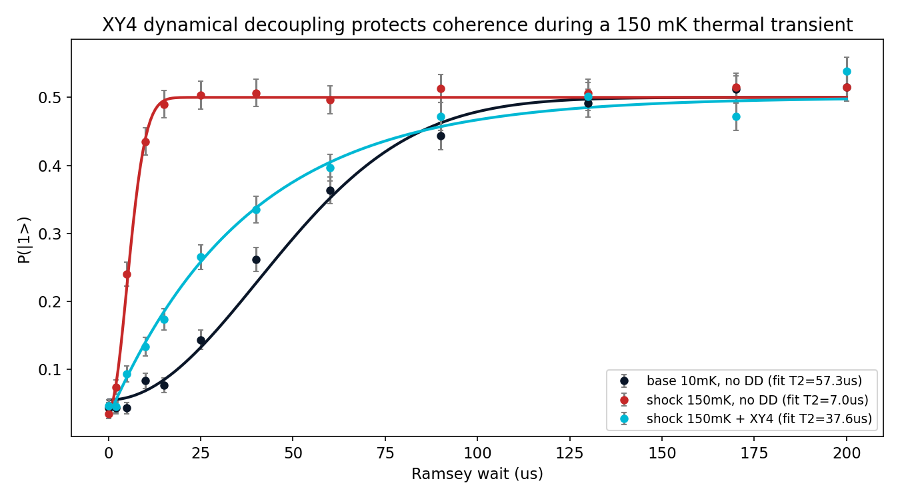
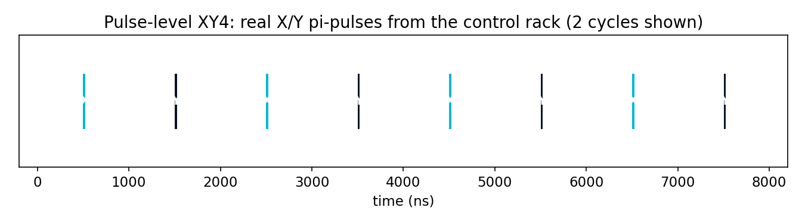
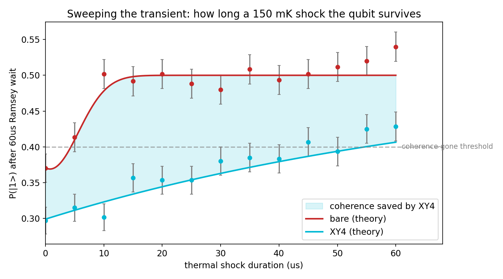

# Episode 3: XY4 vs thermal shock

*QPU-1 Lab Notes, part 3. Every number in this series comes from a real run.*

---

T1 is about energy — the qubit falling from |1> to |0>. But there's a second kind of forgetting, and it's the one that actually kills computations: dephasing. The qubit's phase scrambles, the superposition washes out, and it happens on a timescale T2* that's always shorter than T1. If T1 is the qubit getting tired, T2* is the qubit losing its mind.

So let's attack it. I hit QPU-1 with a thermal shock — 150 mK, hot by dilution-fridge standards — and watched what happened to the phase coherence using a Ramsey experiment: π/2-pulse, wait, π/2-pulse, measure. The fringe contrast as a function of wait time gives you T2* directly.

At base temperature, QPU-1's T2* is 60.3 µs. Under the 150 mK shock: **6.9 µs**. The heat didn't just degrade the coherence — it annihilated it, nearly a factor of nine gone. Thermal photons rattling the qubit, each one randomizing the phase a little more. This is what a temperature excursion does to a real device, and it's why the fridge chapter of episode 1 wasn't decoration.

Read the chart the way an experimentalist would. The Ramsey fringe contrast — the height of the oscillation as you sweep the wait — is the coherence made visible. The base-temperature curve rings out to tens of microseconds, each fringe a little smaller than the last. The shocked curve barely gets started before it dies. You're looking at the same qubit, the same pulses, the same measurement chain; the only thing that changed is the temperature. Phase coherence is fragile in a way energy relaxation isn't, and the chart doesn't let you look away from that.

Now the counterattack: XY4.

XY4 is a dynamical-decoupling sequence — a pattern of π-pulses (X, Y, X, Y, with carefully spaced delays) interleaved into the wait. The idea is an old one, a cousin of the spin echo from magnetic resonance: if the noise is slow compared to your pulse spacing, each π-pulse flips the sign of the accumulated phase error, and the errors cancel instead of adding up. You're not shielding the qubit from the noise. You're making the noise undo itself.

Think of it like walking a straight line while someone shoves you. If the shoves come slowly and steadily from one side, you can lean against them — that's the echo idea. A single shove halfway (the classic spin echo) corrects a constant drift. But real noise isn't constant; it wanders. XY4's repeating X-Y-X-Y pattern keeps re-zeroing the error faster than the noise can wander away, and alternating the pulse axes cancels the pulse imperfections to first order too. It's a small, clever machine made of microwaves, and it runs *during* the computation's idle time — no extra qubits, no encoding overhead, just pulses.

The key word, as always in this series, is *real*. This isn't an idealized "apply perfect echo" flag in the simulation. My control electronics generate an actual π-pulse schedule — timed microwave pulses with the same imperfections as every other gate on the machine — and the noise model plays them against the thermal dephasing shot by shot.

Result: under the same 150 mK shock, the XY4-protected qubit shows an effective T2* of **37.6 µs**. That's **5.4x protection** — from 6.9 back up to 37.6. Not all the way to the 60.3 µs base value, because the π-pulses themselves aren't perfect and the shock noise isn't infinitely slow. But more than five times the coherence, bought with nothing but microwaves.

Dramatic enough? It gets better. A fixed shock is one thing — but what if the heat *lasts*? I ran a second experiment: fixed 60 µs Ramsey wait, and swept the duration of the 150 mK shock window from 0 to 60 µs. How long can the qubit sit in the fire before its phase is gone?

The bare qubit's coherence is gone after **3.5 µs** of shock. Three and a half microseconds — the phase doesn't even survive a tenth of the Ramsey wait. With XY4 running, the qubit holds on until **43.6 µs**: a **12.5x survival stretch**. The sequence doesn't just slow the damage; it changes the shape of the curve, holding the line while the bare qubit has long since flatlined.

Notice what this second experiment adds beyond the first. The fixed-shock result told us XY4 recovers the decay *rate* — a gentler slope. The duration sweep tells us something different: how long the qubit can *sit in the fire*. Those are different questions with different answers, and a device team facing intermittent thermal events cares about the second one more. A fridge hiccup isn't a new equilibrium; it's a transient. Survival time under transient shock is the operational number, and 43.6 µs of it is the difference between riding out the event and losing the computation.

So XY4 works. Genuinely, measurably works — 5.4x on the decay constant, 12.5x on survival under sustained shock.

But notice what it *doesn't* do. It doesn't get you back to 60.3 µs. It doesn't survive the full 60 µs shock window. Protection is real, and protection is finite. Every shield has a limit, and a number like "12.5x" begs the next question: where exactly does it break, and what sets the breaking point?

That's next episode. I push the shock longer, vary the pulse spacing, and find the edge of the shield — including the moment the data tried to lie to me about where the edge was.

## Honest limits

- The thermal shock is modeled as elevated-temperature dephasing; real thermal excursions also shift qubit frequencies, degrade T1, and can trap quasiparticles — none of which are in this model.
- The XY4 π-pulses carry the machine's standard gate imperfections. A real device team would calibrate these pulses obsessively; mine are stock.
- "Effective T2*" under decoupling is a fitted parameter describing the protected decay, not a fundamental device property — it depends on the sequence, the spacing, and the noise spectrum.
