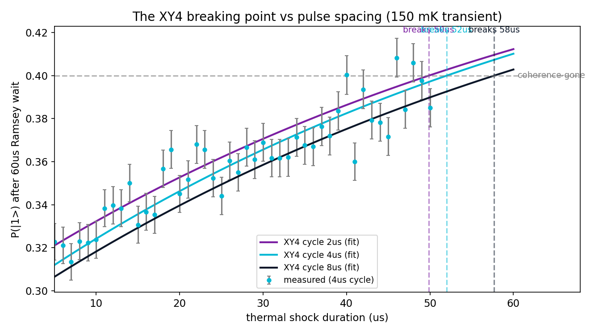

# Episode 4: Every shield has a breaking point

*QPU-1 Lab Notes, part 4. Every number in this series comes from a real run.*

---

Last episode, XY4 bought us a 12.5x survival stretch under thermal shock. Impressive — and it immediately raises the engineer's question: where does it break?

Not "does it break." Everything breaks. The question is *where*, and *what sets the edge*. Because if you know what sets the edge, you can move it.

So I mapped it. Fixed 60 µs Ramsey wait, 150 mK shock, and this time I swept the shock duration in fine steps — 5 to 50 µs at 1 µs increments, 3000 shots per point — for three different XY4 spacings: 2, 4, and 8 µs pulse cycles.

A word on the experimental design, because the numbers encode decisions. One-microsecond steps across a 45 µs range is 46 shock durations; times three spacings, times 3000 shots each, that's over four hundred thousand individual simulated shots. That's not extravagance — it's the price of resolving a breaking point to microsecond precision when every point carries shot noise. Halve the shots and the curve gets ragged; the breaking point smears. More shots per point is the cheapest precision you can buy, and 3000 was where the curves went clean.

Tighter spacing means more π-pulses in the same wait. Naively, more pulses should mean better refocusing, which should mean a later breaking point.

The naive view is wrong.

Breaking points: **49.8 µs** for the 2 µs cycle, **52.0 µs** for the 4 µs cycle, **57.7 µs** for the 8 µs cycle. Read that again: the *tightest* spacing — the most pulses, the most aggressive decoupling — breaks *first*. The sparsest sequence survives longest.

This is the trade at the heart of dynamical decoupling, and it's worth sitting with. Every π-pulse does two things. It refocuses the slow noise — that's the benefit. But it also isn't perfect — every pulse carries its own small error, and those errors accumulate with the pulse count — that's the cost. Tighten the spacing and you get better refocusing *and* more accumulated pulse error. At some point the cost wins. On QPU-1, under this shock, it wins early: the 2 µs cycle piles up pulse errors faster than the extra refocusing can pay for, so it breaks at 49.8 µs while the 8 µs cycle coasts to 57.7.

This is exactly the kind of curve a real device team measures when choosing a sequence. "More decoupling" is not a strategy. The optimum is where marginal refocusing gain equals marginal pulse-error cost, and its location depends on your noise, your gates, your device. You find it by measuring, not by reasoning.

Which brings me to the part of this episode I almost got wrong — and the most important methods lesson of the series so far.

My first analysis was the obvious one: for each spacing, find the shock duration where the protected signal drops below some threshold. Threshold-crossing. Simple, intuitive, and *biased*. Here's the mechanism, because it's worth understanding rather than just avoiding: near the breaking point, the signal is already degraded and the shot noise is a fixed fraction of what's left. Random downward fluctuations will dip below your threshold at shock durations where the *true* underlying signal is still above it. The noisier the data, the more premature dips you get, and the earlier the "breaking point" appears. The bias isn't random — it points early, every time, and it gets worse exactly where the measurement is hardest. The instrument was lying to me, and the lie had a consistent direction.

So I threw it out and did the honest thing: instead of thresholding the raw curve, I fitted the shock echo decay at each point and extracted an effective T2 as a function of shock duration, then read the breaking point off the fitted trend. The fits are immune to single-point dips because they use the whole curve — one unlucky fluctuation can't drag a fit the way it drags a threshold crossing.

The payoff: all three spacings recovered the programmed shock echo T2 of 47.5 µs to within 3%. The model went in with 47.5, the noisy measurement procedure came back with 47.5 — three times, independently. The answer key checks out again, and this time it caught a real analysis bias before it became a published number.

That's the deeper point of this episode. The physics result — tighter spacing breaks earlier — is interesting. But the methods result is the one I'll carry into every future experiment: **when your data is noisy, your analysis choices are part of the instrument, and they need their own validation.** Threshold-crossing felt rigorous. It wasn't. The fit was more work and it was right.

So where does this leave XY4? It's a genuine shield — 5.4x on the decay constant, 12.5x on survival — with a genuine edge, set by the duel between refocusing gain and pulse-error accumulation. On this device, under this shock, the 8 µs cycle is the sweet spot: sparse enough that pulse errors stay small, dense enough that the noise can't wander far between corrections. On your device, with your noise, measure it yourself. That's not a dodge; that's the job. The sequence is free — the characterization is the work, and now you know what the characterization looks like.

Next episode, I stop defending the qubit and start correcting it: the three-qubit bit-flip code, and the question of when error correction actually earns its keep.

## Honest limits

- The breaking points are specific to this shock strength (150 mK), this Ramsey wait (60 µs), and this machine's gate fidelities. Change any of them and the optimum spacing moves.
- The programmed 47.5 µs echo T2 is a model parameter, not a measured device constant — the 3% agreement validates the analysis pipeline, not the physics.
- Real decoupling sequences contend with pulse crosstalk, leakage out of the computational subspace, and heating from the pulses themselves. My π-pulses are clean two-level operations; reality is messier.
