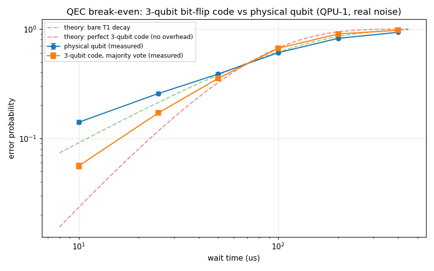
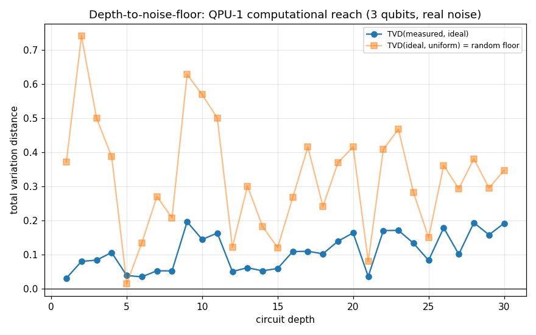

# Episode 5: When error correction actually wins

*QPU-1 Lab Notes, part 5. Every number in this series comes from a real run.*

Quantum error correction makes the boldest promise in the field: encode one logical qubit across several physical ones, fix errors as they appear, and the logical qubit outlives any of its parts. It's the whole ballgame. Without it, quantum computers stay noisy toys forever.

So I asked the simplest version of the question: does the cure beat the disease? I took the smallest code there is — the 3-qubit bit-flip code — and raced it against a bare physical qubit under the most boring noise imaginable: a classical T1 memory channel. The qubits sit and wait, and each one flips with some probability. Decode by majority vote. No cleverness anywhere in the setup.

The code wins. At waits of 50 microseconds or less, the logical error rate sits well below the physical qubit's. At 10 µs: logical 0.056, physical 0.141. The code more than halves the error. That's break-even — the milestone the entire field has been hunting for years — showing up in my little Python machine.

The intuition is clean. At short waits, single bit-flips dominate: one qubit out of three flips, the other two outvote it, the error gets corrected. Three fragile qubits genuinely beat one, because the failure mode the code was designed for is the failure mode that's actually happening. This is the regime error correction was born for.

But the lead shrinks as the wait grows. Around 70 µs the curves cross, and past the crossover the code starts *hurting*. The reason is just as clean: majority vote is a bet that errors are rare and independent. Once the per-qubit flip probability climbs past 0.5, double flips stop being rare — two out of three wrong becomes the likelier outcome — and the vote confidently "corrects" you into the wrong answer. The shield becomes a weapon aimed at yourself. You paid triple the hardware for the privilege of being wrong with confidence.

So break-even is real, and it's conditional. A real code, on real-ish noise, beating the bare qubit — but only while single errors dominate. That conditionality is the whole story of near-term error correction: it's not a magic shield you turn on, it's a trade whose terms depend on the noise you're actually facing. Run the numbers for your regime or don't bother.

Now the caveats, stated plainly, because this is the friendliest possible setup and I won't let you mistake it for the general case:

- The noise was a pure bit-flip channel. Real qubits also suffer phase errors, and this code does nothing about those. A code that handles both needs more qubits and considerably more machinery.
- The decode was perfect classical post-processing. In a real machine you extract the syndrome by entangling ancilla qubits and measuring them — and those measurements are noisy, which means the error *detection* itself introduces errors. I paid none of that cost. This is the single biggest gap between my result and a real device.
- No mid-circuit measurement, no faulty gates during encoding. The code got every advantage the model could give it.

The honest read: break-even under these conditions is a necessary milestone, not a sufficient one. It says the *idea* works. The engineering bill — noisy syndrome extraction, phase errors, fault-tolerant gadgets — still has to be paid, and nobody knows the final price yet. The follow-up experiment already queued in this vault is the honest hard version: QEC with noisy syndrome extraction, where I expect break-even to fail. That's the one that will actually teach us something, because easy wins teach you nothing about the price.

## How deep can you go

Second question, same episode, because it belongs here: how deep a circuit can you run before the noise floor eats everything? I wanted a single number — a "reach" — for how far QPU-1 can go.

First attempt: linear cross-entropy benchmarking, XEB, the metric from the quantum-supremacy era. It returned fidelities of 5.71 and 1.84.

Fidelity cannot exceed 1. The metric was lying.

Here's why, and it's worth knowing: XEB only proxies fidelity for *scrambling* circuits — circuits whose outputs follow Porter–Thomas statistics, the speckle pattern you get when quantum interference has thoroughly randomized the output. My test circuits were 3 qubits with one CX per layer. They don't scramble. They never get anywhere near Porter–Thomas; the information hasn't spread, the interference hasn't randomized, and the statistical assumptions XEB rests on simply don't hold. Applying XEB to them is like using a thermometer to measure weight: the number means nothing, and the impossible values were the instrument telling me so.

So I threw XEB out and built a dumber, honest metric: a normalized total-variation-distance score, S = 1 − TVD(measured, ideal) / TVD(ideal, uniform). S = 1 means the output matches the ideal distribution exactly; S = 0 means it's indistinguishable from uniform noise. No fancy statistical assumptions — just "how far is what I measured from what I wanted, relative to pure garbage." I set the noise floor at S < 0.10 and asked: at what depth does the machine fall through it and stay there?

Through depth 30, it never did. At depth 30, S = 0.4474 — degraded, clearly, but not floored. Reach: not established in 30 layers. Either these circuits need to go much deeper, or — more likely — the test needs a scrambling circuit family where the noise actually compounds the way it does in real algorithms. A non-scrambling circuit is, in a sense, too easy to keep alive; the errors don't mix the way they do when the circuit is doing real work.

The meta-lesson is the real result of this half: the first metric lied, and the impossible numbers were the tell. If I hadn't sanity-checked 5.71 against the hard ceiling of 1.0, I'd have published garbage with a straight face. Checking your metric against impossibility isn't paranoia. It's the job. Every number you publish should have survived at least one attempt to prove it absurd.

## Honest limits

- The QEC result is the best possible case: bit-flip-only noise, perfect decode, noiseless encoding. Real fault tolerance is strictly harder than this, in every direction.
- The depth scan used non-scrambling circuits — which is exactly why XEB failed and exactly why "reach" stays unanswered. The next version needs scrambling circuits or a much deeper scan.
- Both halves are classical simulations of small systems. The qualitative lessons transfer (break-even exists but is conditional; validate your metric). The specific numbers don't.

*All charts from real runs on QPU-1.*
