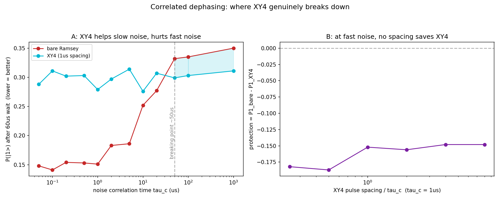

# Episode 6: The noise is never white

*QPU-1 Lab Notes, part 6. Every number in this series comes from a real run.*

Textbooks love white noise: every instant independent, no memory, mathematically clean. Real qubits never got the memo. Their environments drift — magnetic flux wanders in tunable qubits, charge traps in the substrate flip between states, two-level defects in the dielectrics blink on and off, the fridge temperature creeps by microkelvins. The noise has *memory*, and memory changes everything about how you fight it.

In episodes 3 and 4, XY4 was the hero: dynamical decoupling pulses that refocused dephasing and bought 5x to 12x protection against thermal shock. But that noise was quasi-static — one frozen detuning per shot, the same enemy from start to finish. This episode asks what happens when the enemy moves.

I modeled the dephasing as an Ornstein–Uhlenbeck process. Picture a random walk on a leash: the detuning wanders randomly, but a restoring pull keeps it from drifting off forever. The leash length is the correlation time τc. Short τc means the noise forgets itself quickly — fast and jittery, close to white. Long τc means it drifts slowly — close to the old frozen-detuning case. One model, both regimes, and a knob to sweep between them. Then I ran the same 60 µs Ramsey experiment under XY4 and watched what survived.

The result is a clean dividing line: XY4 protects the Ramsey signal only when τc ≳ 50 µs. Below that, the π-pulse errors exceed the refocusing benefit — and XY4 *actively hurts*. More protection, worse coherence. The shield becomes the damage.

The mechanism is straightforward once you see it. XY4 works by flipping the qubit's phase accumulation faster than the noise changes, so the wander cancels itself out — whatever the detuning did in the first half, it undoes in the second. But every π-pulse is itself imperfect. Each one injects a little error: a slight over-rotation, a bit of leakage, some crosstalk with the neighbors. When the noise is slow, a handful of pulses buys a lot of cancellation, and the trade is worth it. When the noise is fast, the detuning has already changed by the time the next pulse arrives, so the refocusing mostly misses — and you've still paid the pulse-error tax on every flip. Dozens of pulses, each costing more than it saves. The math doesn't care about your intentions.

Think of it as a race. The pulses are trying to outrun the noise's memory: flip faster than the environment changes, and you win. But every contestant you field — every pulse — carries its own entrance fee. When the noise is slow, a few cheap flips win the race easily. When the noise is fast, you'd need an impossible number of flips to keep up, and the entrance fees bankrupt you before the finish line. There is no version of this race where throwing more imperfect pulses at fast noise works. The fees always win.

It's worth noting what the model does at the extremes, because it confirms the picture. Stretch τc toward infinity and the wandering freezes out — you recover the old quasi-static case from episodes 3 and 4, where XY4 was the hero. Squeeze τc toward zero and the noise approaches white: no memory, nothing to refocus, and no pulse sequence on Earth can help — the only move is to fix the noise source itself. The 50 µs dividing line sits between those two certainties, and a practitioner would use it exactly like that: measure your τc, and if it lands well above the line, pick your spacing and pulse count with confidence. If it lands well below, don't reach for a fancier sequence — go find what's making the noise fast and kill it at the source. Decoupling is a treatment for slow noise. Fast noise is a hardware problem.

This reframes episodes 3 and 4 honestly: those wins were real, but they were wins *in the slow-noise regime*. Same sequence, fast noise, and I'd have published the opposite conclusion. The sequence didn't change. The noise did. Anybody who tells you "XY4 protects coherence" without asking about the correlation time is selling you half a sentence — and the missing half is the one that decides whether the medicine helps or harms.

The real-world lesson is blunt: know your noise before picking your shield. Characterize the correlation time first, then choose the decoupling sequence — its spacing, its pulse count — for the noise you actually have. The wrong protection isn't neutral. It's worse than none, because it charges you pulses while delivering nothing.

This is also why the field obsesses over noise spectroscopy. You can't fight what you haven't measured. In practice that means running diagnostic sequences — Ramsey fringes, echo decays, CPMG trains with varying pulse counts — and reading the noise spectrum off the results before you ever design the protection. A lab that skips characterization and slaps XY4 on everything is prescribing medicine without a diagnosis. Sometimes it works. Sometimes it hurts. You don't get to know which until you measure — and now you know exactly where the line is for this sequence on this timescale: around 50 µs. Move to a different qubit, a different fridge, a different fabrication run, and the line moves with them. Which is precisely the point. There is no universal shield. There's only the right shield for the noise in front of you, and the noise in front of you is something you have to go and measure.

If there's a through-line to this whole series, it's this episode's lesson wearing different clothes each time: the details of the noise decide everything. Break-even, protection, reach — every result so far has come with a regime attached, and outside that regime the conclusion flips. That's not a weakness of the work. That's the work.

## Honest limits

- The Ornstein–Uhlenbeck model is phenomenological — a reasonable stand-in for real 1/f-ish dephasing, not a first-principles derivation of any specific device's noise.
- π-pulse errors in the model are a fixed per-pulse cost. Real pulse errors have their own structure — over-rotation, leakage, crosstalk — that this doesn't capture.
- One qubit, one 60 µs Ramsey. Multi-qubit correlated noise — the kind that actually kills error correction — is a harder problem this episode doesn't touch.

*Chart from real runs on QPU-1.*
