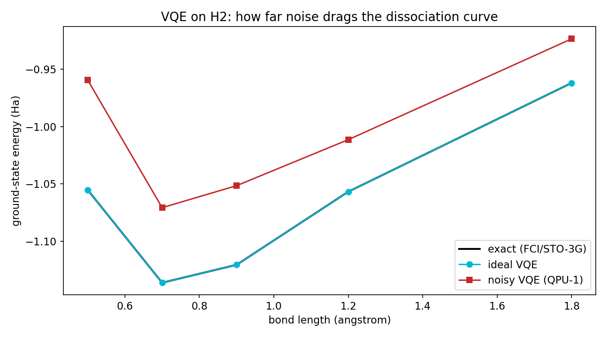

# Quantum chemistry is harder than it looks

*QPU-1 Lab Notes, part 7. Every chart in this series comes from a real run. No hand-waving.*

---

Sooner or later every quantum builder asks the chemistry question. Drug discovery, batteries, catalysts — the prize that justifies the billions — all live at the end of one sentence: "simulate a molecule." The algorithm that promises it is VQE, the Variational Quantum Eigensolver. Tonight I pointed QPU-1 at the simplest molecule in the universe, hydrogen, and learned why that prize is still far away.

Hydrogen is the hello-world of quantum chemistry. Two atoms, two electrons. The exact answer is computable on a laptop — which is exactly what you want, because it means you can check your work.

## Building the molecule from scratch

I started from nothing but the atoms: STO-3G molecular integrals computed from closed-form formulas, then a restricted Hartree-Fock reference and a two-determinant full configuration interaction (FCI) calculation to get the exact ground-state energy. At the equilibrium bond length of 0.7474 Å, my FCI says −1.1371757 Ha. The standard chemistry package PySCF says the same thing, to seven decimals. The foundation is solid — if VQE disagrees with this, VQE is wrong.

Next the Hamiltonian gets mapped onto qubits via Jordan-Wigner, landing on a 16×16 matrix with 15 Pauli terms, then tapered by two Z₂ symmetries down to just 2 qubits. This is the real workflow, the same reductions a real device would use. No shortcuts.

## The ideal run

First I ran VQE with the noise switched off. This is the "does the algorithm even work" test, and it passed completely: at every bond length along the dissociation curve, ideal VQE matched FCI to five decimals. The optimizer — plain gradient descent, nothing fancy — found the right energy every time.

That's worth pausing on. The quantum algorithm for chemistry is *correct*. The math converges. The curve I got is the textbook dissociation curve of H₂, smooth and right.

Then I turned the noise on.

## The noise drag

With realistic noise — the gate errors, T1 decay, and readout misclassification from the model we've spent this whole series characterizing — VQE's energies landed 38 to 96 mHa above the exact answer, depending on the bond length.

Chemical accuracy — the threshold where a calculation actually tells you something useful about chemistry — is 1.6 mHa.

Read those two numbers again. We're not off by a little. We're off by a factor of twenty to sixty. And remember what H₂ is: the easiest molecule there is, two qubits after tapering, 15 Pauli terms, the shallowest VQE circuit you'll ever run. Every real molecule is worse — more electrons, more terms, deeper circuits, more exposure to exactly the noise that's already winning here. This chart is the *best case*. The honest NISQ limit, drawn as a curve: the ideal VQE line sits on top of the exact FCI line, and the noisy line floats above it like a bad ceiling. You could squint at it and say "roughly the right shape" — but chemistry doesn't grade on rough shape. A reaction barrier wrong by 40 mHa is a reaction you can't predict.

Now, an honest experimentalist would ask: is this the noise, or is my VQE bad? That question turned into the best lesson of the night.

## The ansatz lesson

My first VQE used the standard playbook: a 6-parameter hardware-efficient ansatz built from RX rotations and entangling gates, the kind of circuit you see in every tutorial. It got stuck 18 mHa above FCI even in the *ideal* case — no noise at all. The optimizer wandered into a local-minimum trap and stayed there. Six parameters, thousands of optimizer steps, and it couldn't find the bottom of a hill it could see.

Then I tried something smarter instead of something bigger. The tapered Hamiltonian has a block structure — most of the action happens in one corner of the Hilbert space. A 1-parameter RY+CNOT ansatz built to exploit that structure hit FCI to 0.0 μHa. Exact. One parameter, first try.

One clever parameter beat six dumb ones plus thousands of optimizer steps.

This is the lesson that generalizes past quantum computing: **ansatz design beats optimization**. The search space matters more than the search. A well-chosen one-parameter model outperforms a generic six-parameter model, because the generic model's extra freedom is mostly directions that don't lead anywhere — and every direction the optimizer can wander is a direction it can get lost in. I've seen the same thing in machine learning, in app architecture, in everything: understanding the problem's structure beats throwing parameters at it.

## What this means for the dream

The chemistry dream is alive in the same way a rocket on a drawing board is alive. Ideal VQE converges exactly, on real reduction pipelines, with reference numbers verified to seven decimals. The algorithm is not the problem.

The problem is the machine. 38–96 mHa of noise drag against a 1.6 mHa target means you don't need a better algorithm — you need roughly a hundred times less noise, or error correction that works, or both. That's the whole NISQ era in one chart: correct in principle, drowned in practice.

And the meta-lesson: when I look back at this series, the nights that taught me the most weren't the ones where the machine worked. They were the ones where it failed in an interesting way — XY4 hurting under fast noise, XEB lying about fidelity, a 6-parameter optimizer losing to one parameter. The simulator's job isn't to make quantum look easy. It's to make the difficulty *measurable*.

Next episode: the error that adds up in the worst possible way.

## Honest limits

- The noise is phenomenological Monte-Carlo, not a full Lindblad master equation. The 38–96 mHa drag is representative of the noise regime, not a prediction about any specific device.
- VQE was run on H₂, the easiest molecule there is. Larger molecules have deeper circuits, more terms, worse noise — everything here is a best case.
- The "ideal" run used a classical optimizer with exact gradients. On real hardware, gradient estimation is itself noisy, which only makes the optimizer's job harder.
