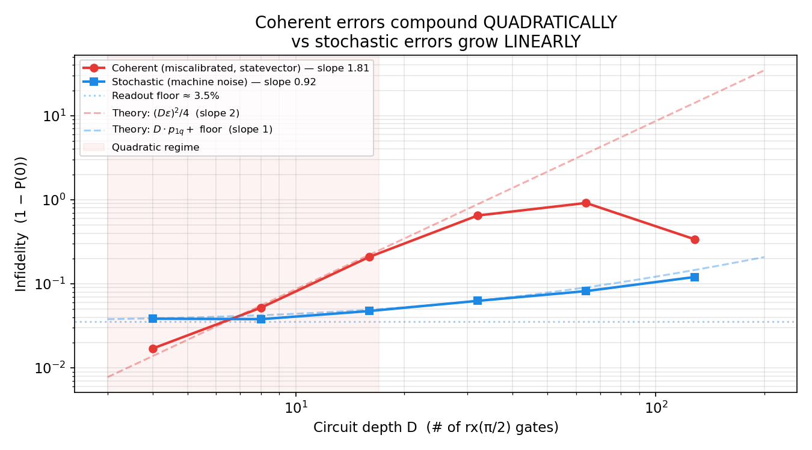

# Coherent errors are silent killers

*QPU-1 Lab Notes, part 8. Every chart in this series comes from a real run. No hand-waving.*

---

There are two ways for a gate to be wrong, and they are not equal.

The first way is stochastic: sometimes the gate overshoots, sometimes it undershoots, and it averages out. Random errors. The second way is coherent: the gate overshoots by the same amount *every single time*. A miscalibrated X gate that always rotates 1.01π instead of π. Same error, every shot, compounding in the same direction.

Tonight I put them head to head across circuit depth, and the result is why calibration people get paid more than you'd think.

## The setup

I ran the same circuits two ways. In one world, every gate carries a systematic X over-rotation — a fixed extra angle added after every gate, identical every time (the `miscalibrated()` hook in the simulator, built for exactly this comparison). In the other, the gates carry stochastic noise of the same per-gate magnitude. Same circuits, same depths, same everything else. Then I measured how fast the results degraded as the circuits got deeper.

The physics intuition is simple, and it matters. Stochastic errors are a random walk: each one points a random direction, so N of them add up like √N. Coherent errors are a march: each one points the *same* direction, so N of them add up like N. And infidelity — the thing that actually hurts you — goes like the square of the accumulated error. So stochastic infidelity grows linearly with depth, and coherent infidelity grows *quadratically*.

That's the theory. Here's what the machine measured.

## Quadratic vs linear

The coherent curve fits a quadratic with slope 1.81 against a theoretical 2.0. The stochastic curve fits a line with slope 0.92 against a theoretical 1.0. Both match theory almost embarrassingly well — the model is behaving exactly like the textbooks say it should, which is how you know the model is worth trusting.

But look at what the numbers *mean*. At depth 4, the two errors are barely distinguishable — a small over-rotation and a small random error cost you about the same. At depth 16, the coherent error has pulled away decisively. The quadratic doesn't just grow faster; it *accelerates*. Every additional gate doesn't just add its own error — it amplifies the error that's already accumulated. That's the compounding. It's interest on a debt you didn't know you had.

The stochastic line, meanwhile, just plods along, linear and predictable. Randomness is honest. It tells you what it costs upfront.

Two more details from the run. The stochastic curve bottoms out on a ~3.5% readout floor — the irreducible cost of the measurement chain we toured back in episode 1, present no matter how clean the gates are. And at large enough error the coherent curve stops following the quadratic and wraps around the Bloch sphere — the accumulated over-rotation literally laps itself, and the error signature folds back. The math is still exact; the curve just isn't monotonic anymore. Another reason you calibrate instead of modeling your way out.

## Why this keeps me up at night

Everything else in this series has been about errors you can see. Thermal shock collapses T2* and the Ramsey fringes visibly die. Readout misclassification shows up as 01/10 counts in the histogram. Even the VQE noise drag last episode was at least *visible* — a line floating above where it should be.

Coherent error is different. A circuit with a 1% systematic over-rotation looks almost perfect at shallow depth. The histogram is clean. The Bell fidelity is fine. You'd sign off on it. Then you run the deep circuit — the VQE, the QEC block, the thing you actually built the machine for — and the error has been compounding the whole time, silently, quadratically. The shallow tests pass and the real workload fails, and nothing in the shallow data told you why.

This is why the calibration people get paid. On a real device, gates drift. The microwave pulse that was perfect on Monday is 0.5% off by Friday because the fridge warmed by a millikelvin or the amplifier aged. If that drift is coherent — and it usually is — your deep circuits are dying while your shallow benchmarks look healthy. The fix isn't better algorithms. It's relentless, boring, repeated calibration: tune the pulses, check the drift, tune again. And note the cruel asymmetry: stochastic noise you can average away with more shots, but no amount of averaging fixes a systematic rotation — the march doesn't cancel itself. The least glamorous job in the lab is the one the quadratic rewards most.

## The pattern of the series

Looking back across all eight episodes, there's a through-line I didn't plan: the dangerous errors are never the loud ones. The loud ones — thermal shock, readout confusion — announce themselves. The killers are the quiet ones: noise correlation time too short for your XY4 to help, a fidelity metric that returns impossible values, an optimizer stuck in a local minimum, a systematic rotation adding up in the same direction every time. Every protection has a breaking point, and the breaking points are always where you weren't looking.

The simulator's real product isn't the numbers. It's the habit of looking.

One episode left: what all of this was for.

## Honest limits

- The over-rotation was applied identically after every gate — a clean, uniform miscalibration. Real drift varies gate to gate and qubit to qubit, which mixes coherent and stochastic behavior.
- The small-error regime is where the quadratic holds. Once the accumulated error gets large, the curve wraps the Bloch sphere and the simple scaling breaks — the chart shows this, and it's real physics, not a modeling artifact.
- As always: phenomenological Monte-Carlo noise, not a full Lindblad master equation. The scaling laws (quadratic vs linear) are the robust part; the exact slopes belong to this noise model.
